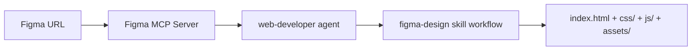

# Figma MCP Demo

Turn any **Figma design into production-ready web code** using the [Figma MCP server](https://mcp.figma.com/mcp) and a custom **web-developer** agent. Point it at any Figma file — dashboards, landing pages, components, or full app screens.

---

## What this demo does

1. You provide a **Figma URL** for a design.
2. The **web-developer** agent connects to Figma through the **Figma MCP server**.
3. It extracts layout, colors, typography, spacing, and assets following the **figma-design** skill.
4. It generates semantic **HTML**, modern **CSS**, and **vanilla JavaScript** — ready to open in a browser.



---

## Repository layout

```
.github/
  agents/
    web-developer.md                 # The Figma-to-code agent
  skills/
    figma-to-production-web-code/
      SKILL.md                       # Step-by-step Figma workflow
  copilot-instructions.md            # Repo-level Copilot guidance
.vscode/
  mcp.json                           # Figma MCP server config
README.md
```

---

## Prerequisites

- A **Figma account** and a design file you can access
- A **Figma personal access token** (or OAuth via the hosted MCP) — see [Figma MCP setup](#figma-mcp-setup)
- One of the following clients:
  - **VS Code** with the **GitHub Copilot** + **Copilot Chat** extensions (agent mode)
  - **GitHub Copilot CLI** (`gh copilot` / `copilot`)
  - **GitHub Copilot app / github.com** (Copilot Chat with MCP support)
- *(Optional)* **Node.js 18+** to serve the generated site locally

---

## Figma MCP setup

The Figma MCP server is already configured in [.vscode/mcp.json](.vscode/mcp.json):

```json
{
  "inputs": [],
  "servers": {
    "figma": {
      "url": "https://mcp.figma.com/mcp",
      "type": "http"
    }
  }
}
```

The hosted server at `https://mcp.figma.com/mcp` uses **OAuth** — on first use your client will prompt you to sign in to Figma and authorize access. No token needs to be stored in the repo.

> If your client requires a token instead of OAuth, create a Figma personal access token (Figma → **Settings → Security → Personal access tokens**) and provide it to your MCP client as an environment variable or secret. **Never commit the token.**

---

## Running the demo

### Option A — VS Code (agent mode)

1. Open this folder in VS Code.
2. Ensure the **GitHub Copilot** and **Copilot Chat** extensions are installed and you are signed in.
3. Open the **Copilot Chat** view and switch to **Agent** mode.
4. When prompted, **start / trust the `figma` MCP server** (VS Code reads `.vscode/mcp.json`) and complete the Figma OAuth sign-in.
5. Select the **web-developer** agent from the agent picker.
6. Paste a prompt with your Figma URL:

   ```
   Build this Figma design as production HTML/CSS:
   https://www.figma.com/design/<fileKey>/My-Design?node-id=<nodeId>
   ```

7. The agent fetches the design, extracts tokens, downloads assets, and writes `index.html`, `css/`, `js/`, and `assets/`.
8. Open `index.html` in a browser (or use the [local preview](#optional-preview-locally)).

### Option B — GitHub Copilot CLI

1. Install the CLI: `npm install -g @github/copilot` (or `gh extension install github/gh-copilot`).
2. From the repo root, start Copilot:

   ```bash
   copilot
   ```

3. Ensure the `figma` MCP server is registered with the CLI (it reads MCP config; add the server if prompted using the URL `https://mcp.figma.com/mcp`, type `http`).
4. Ask it to run the demo:

   ```
   Using the web-developer agent and the figma-design skill, build this design:
   https://www.figma.com/design/<fileKey>/My-Design?node-id=<nodeId>
   ```

5. Approve the MCP tool calls when prompted and review the generated files.

### Option C — GitHub Copilot app (github.com / desktop)

1. Open **Copilot Chat** and connect this repository.
2. Add the **Figma MCP server** in your Copilot MCP settings using `https://mcp.figma.com/mcp` (type `http`) and authorize via OAuth.
3. Reference the agent and skill in your prompt:

   ```
   Use the web-developer agent to convert this Figma design into
   production HTML/CSS following the figma-design skill:
   https://www.figma.com/design/<fileKey>/My-Design?node-id=<nodeId>
   ```

4. Review and commit the generated output.

---

## Example prompts

```
Build the selected frame as a responsive HTML page.
Figma: https://www.figma.com/design/<fileKey>/My-Design?node-id=<nodeId>
```

```
Extract the design tokens (colors, typography, spacing) from this Figma file
and generate css/variables.css: https://www.figma.com/design/<fileKey>/...
```

```
Convert only the "Card" component into a reusable, accessible BEM component.
```

---

## Expected output

After a run you should see:

```
index.html
css/
  reset.css
  variables.css
  styles.css
js/
  main.js
assets/
  images/
  icons/
```

- **Semantic HTML5** matching the Figma structure
- **CSS custom properties** mapped from Figma design tokens
- **Responsive** layout (mobile-first with breakpoints at 768px / 1024px / 1280px)
- **WCAG 2.1 AA** accessibility (alt text, ARIA, keyboard support, contrast)

### Optional: preview locally

```bash
npx serve .
# or
python -m http.server 8000
```

Then open `http://localhost:8000` (or the port `serve` reports).

---

## How it fits together

| Piece | File | Role |
|---|---|---|
| MCP config | [.vscode/mcp.json](.vscode/mcp.json) | Connects your client to the Figma MCP server |
| Agent | [.github/agents/web-developer.md](.github/agents/web-developer.md) | Drives Figma-to-code generation |
| Skill | [.github/skills/figma-to-production-web-code/SKILL.md](.github/skills/figma-to-production-web-code/SKILL.md) | Step-by-step Figma extraction workflow |
| Repo instructions | [.github/copilot-instructions.md](.github/copilot-instructions.md) | Conventions Copilot applies automatically |

---

## Troubleshooting

- **MCP server not connecting** — confirm the `figma` server is started/trusted in your client and that you completed the Figma OAuth sign-in.
- **Agent not listed** — make sure the workspace is open at the repo root so `.github/agents/` is discovered.
- **Empty or partial design data** — verify the `fileKey` and `node-id` in the URL and that your Figma account has access to the file.
- **Assets missing** — the agent downloads image/icon nodes into `assets/`; approve any file-write tool prompts.